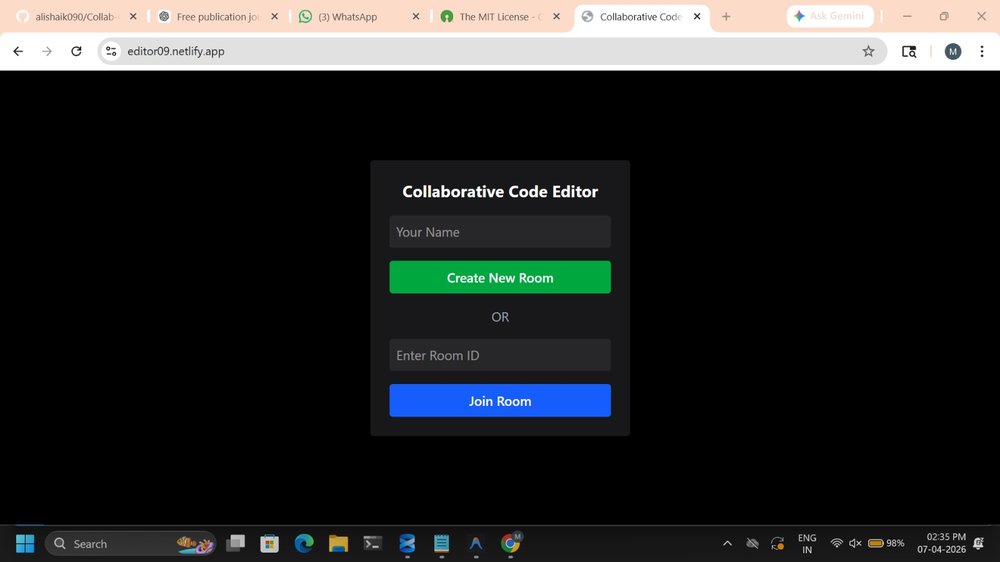
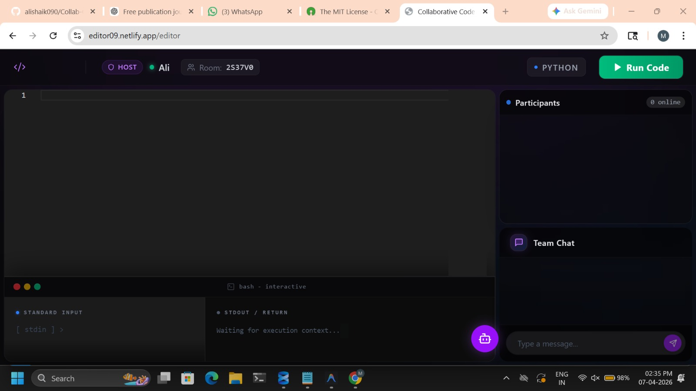

# 🚀 Collab Code Editor: Real-Time Collaborative Coding Platform


---

## 📌 Overview

*Collab Code Editor* is a real-time collaborative coding platform that enables multiple users to simultaneously write, edit, and execute code in a shared environment.

The system integrates WebSocket-based synchronization, room-based collaboration, and cloud-based code execution to provide a seamless and interactive coding experience for developers and learners.

---

## 🌐 Live Demo

Access the deployed application here:  
👉 editor09.netlify.app/

---

## 🚀 Features

* Real-time multi-user collaboration  
* Room-based coding sessions  
* Host and participant role management  
* Integrated team chat  
* Live code execution using Judge0 API  
* Multi-language support  
* Live cursor synchronization  

---

## 🧠 Technology Stack

* **Frontend / UI**: React.js, Monaco Editor, Socket.IO Client  
* **Backend API**: Node.js, Express.js  
* **Realtime Communication**: Socket.IO (WebSockets)  
* **Code Execution**: Judge0 API  

---

## 📸 Application Preview

### 🏠 Room Creation
<p align="center">
  
</p>

### 💻 Collaborative Editor
<p align="center">
  
</p>

---

## ⚙️ Installation
```bash
git clone https://github.com/alishaik090/Collab-Code-Editor.git
cd Collab-Code-Editor

Install dependencies:

cd client
npm install

cd ../server
npm install
▶️ Usage

Run the application:

# start backend
cd server
npm run dev

# start frontend
cd client
npm start
```
Steps:

* Enter your name
* Create or join a room
* Share room ID with collaborators
* Start real-time coding
* Run code and view output

📊 Methodology
* User Connection
* Users join using a unique room ID
* Real-Time Synchronization
* Code updates transmitted via WebSockets
* Server broadcasts updates instantly
* Collaboration Management
* Host controls session
* Participants edit simultaneously
* Code Execution
* Code sent to Judge0 API
* Output shared with all users


📄 Research Contribution

* This project provides a unified collaborative coding framework by:

* Integrating editing and execution in one platform
* Reducing workflow fragmentation
* Supporting distributed development environments
* Enhancing interactive learning


👨‍💻 Authors
* SK Mohammad Ali
* Sujay Bhavani Bhumana


📜 License

* This project is licensed under the MIT License.

🙌 Acknowledgements
* Socket.IO for real-time communication
* Judge0 for execution API
* React and Node.js communities

📚 Citation

* If you use this work, please cite:
```bash
@article{collabcodeeditor2026,
  title={Real-Time Collaborative Coding Platform},
  author={SK Mohammad Ali and Sujay Bhavani Bhumana},
  year={2026}
}
